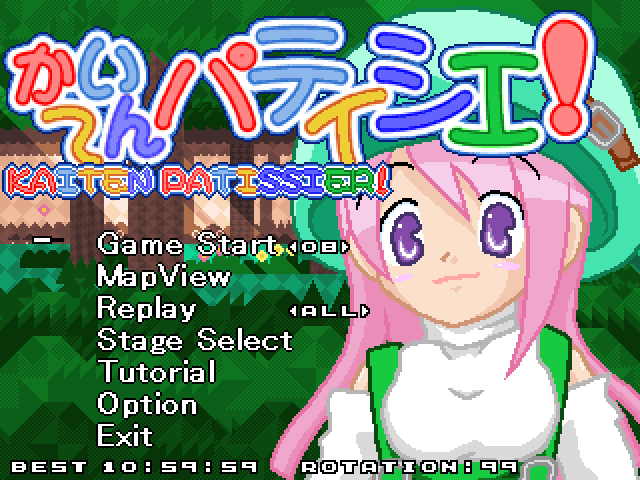
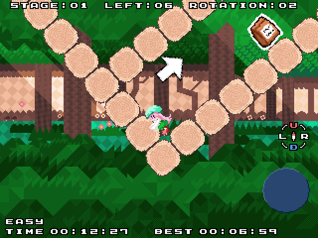

/*==========================================================================
 *
 *  Copyright (C) 2008 あるふぁ〜秘密基地(Alpha Secret Base). All Rights Reserved.
 *
 *  ○ゲームタイトル：かいてんパティシエ！
 *  ○ジャンル      ：お手軽回転アクションパズル
 *  ○プレイ人数    ：一人
 *  ○バージョン    ：1.05
 *  ○公開日付      ：2008/05/31
 *  ○更新日付      ：2009/05/16
 *
 ==========================================================================*/

・はじめに
  リプレイファイルを作成するためディスク容量が必要です。
  GP2X版はSDカードからの起動を推奨します。
  Windows版はfullscreen.batを実行するとフルスクリーンで起動します。
  Windows版はfullscreen2.batを実行すると２倍拡大のフルスクリーンで起動します。
  Windows版はwindow2.batを実行すると２倍拡大のウインドウで起動します。
  実行ファイルの引数オプション
    -f フルスクリーン
    -r ２倍拡大（640*480）

  手軽に地形を使ったアクションパズルを楽しんでもらえたら良いと思います。

  またこのゲームに使われているファイルは「やわらかライセンス」です。
  ゲームを作ってみたい、改造したい方は自由に利用して構いません。

  トライアングル・サービスの藤野社長に「ACTION LOVE!」の題字を書いていただきました。
  画像はやわらかライセンスと言う事で許可いただきました。
  この力強いACTION LOVE!の様に、皆さんも俺のゲームを作ってみませんか？

  各プラットホームでの実行ファイルも収録しています。
  RotateGear.exe :Windows用の実行ファイル
  RotateGear.gpe :GP2X用の実行ファイル

  Windows版をコンパイルするにあたって
    makefileはMakefile.winです。

  gp2x版をコンパイルするにあたって
    makefileはMakefile.gp2xです。

  MacOSX版をコンパイルするにあたって
    makefileはMakefile.macosxです。

  Linux版をコンパイルするにあたって
    makefileはMakefile.linuxです。

  本プログラムはSDL(Simple Directmedia Layer)を使って作成しています
  SDLはLGPLに従って配布されています
  http://www.libsdl.org/license.php

  SDL(Simple Directmedia Layer)
  http://www.libsdl.org/

・操作方法
  上下：項目の選択
  左右：キャラクターの移動、項目の選択
  パッド1（キーボード:Z、GP2X:X）    ：壁を押しながらボタンで地形の回転　項目の決定
  パッド2（キーボード:X、GP2X:B）    ：ジャンプ、上キーでもジャンプできます。
  パッド3（キーボード:C、GP2X:Y）    ：メニュー
  パッド7（キーボード:F1、GP2X:Vol-）：音量を小さくする
  パッド8（キーボード:F2、GP2X:Vol+）：音量を大きくする
  キーボード:ESC、GP2X:L+R+HOME      ：強制終了

・メニュー
  GameStart  ：ゲームを開始します。左右でステージの選択
  MamViwe    ：ステージを見ることができます。左右でステージの選択
  StageSelect：ステージを選んで遊ぶことができます。１つのステージを繰り返し遊ぶのに最適です。
  Replay     ：保存されているリプレイを再生します。ALL：連続再生、ONE：１ステージのみ再生。
               １ボタンで最速タイム、２ボタンで最小回転のリプレイを再生します。
  Tutorial   ：操作説明です。
  Option     ：ゲーム中の設定やサウンドテストなど。言語（日本語、英語）の設定もできます。
  Exit       ：アプリケーションを終了します。

・システム
  壁を押した状態で１ボタンを押すと地形を回して足場にする事ができます。
  すべての材料を集めるとステージクリアとなり、次のステージに進む事ができます。
  歯車を中心に動く足場などが存在します。何処を回すのが近道なのか探してみてください。

  仕掛け
    歯車    ：歯車と線でつながっている物は歯車を中心に動きます。
              歯車とつながるのは、のれる床、ブロック、材料トレイがあります。
    箱      ：箱は押す事ができます。
              箱を２個同時に押す事はできません。頭に箱がある場合ジャンプはできません。
    スイッチ：同じ色のブロックを消す事ができます。
              スイッチはブロックや箱を重ねる事で押せます。

  各ステージには目標タイム、目標回転回数が設定されています。
  ステージセレクト画面で確認できます。
  記録に挑戦してみましょう。

  アイテムを最後の一個まで取ると、シークレットアイテムが出現します。
  探してみましょう。
  すべて見つけるとエンディングが変化します。

・ストーリー
  小人のピピは子供が大好き！
  町から町へ旅をしながら、子供達にお菓子を作っています。

  ピピが作るお菓子は不思議なお菓子。
  このお菓子を食べるとみんな楽しくなります。
  今日もピピは材料探しの旅に出かけるのでした。

・スタッフ
  D.K
  kenmo
  わんきち
  クミ
  taro
  液
  HIZ
  御影功
  オランダ
  maro
  nanasi
  おめが
  teru
  カルタ
  いぬ研究所
  土渦
  六花
  信介
  LiV
  ひで
  KaOS
  BCD
  一色
  藤野
  ゲームヘル2000の皆さん
  テストプレイしていただいた皆さん

・謝辞
  GP2X版の開発にあたって一色さんにはお世話になりました。
  一色さんのHP：The 59TH STREET ROOM
  URL：http://homepage2.nifty.com/isshiki/

  キャラクターデザイン、アニメーションをクミさんに作成していただきました。

  BGM、効果音をわんきちさんに作成していただきました。
  わんきちさんのHP：NamelessElementLab
  URL：http://d.hatena.ne.jp/wang-zhi/

  ステージの作成、調整、グラフィックの作成を液さんに協力していただきました。

  企画、ステージの調整をkenmoさんに協力していただきました。

  ステージの作成を御影功さんに協力していただきました。
  御影功さんのHP：御影　功の日記
  URL：http://d.hatena.ne.jp/KouMikage/

  ステージの作成をいぬ研究所さんに協力していただきました。
  いぬ研究所さんのHP：HAFU いぬ研究所
  URL：http://anime.geocities.jp/head_jockaa/

  ステージの作成をnanasiさんに協力していただきました。

  ステージの作成をmaroさんに協力していただきました。

  ステージの作成をオランダさんに協力していただきました。
  オランダさんのHP：Awesomeness In a Box
  URL：http://www.awesomenessinabox.com/

  ステージの作成をHIZさんに協力していただきました。
  HIZさんのHP：HIZの物置
  URL：http://hizuoka.web.fc2.com/index.html

  ストーリー作成をカルタさんに協力していただきました。

  ステージ作成を土渦さんに協力していただきました。
  土渦さんのHP：土渦古物商店
  URL：http://tsutiuzu.blog41.fc2.com/

  ギャラリーのイラストを六花さんに描いていただきました。

  エンディングのイラストを信介さんに描いていただきました。

  エンディングのイラストをLiVさんに描いていただきました。
  LiVさんのHP：mixi
  URL：http://mixi.jp/show_friend.pl?id=18159530

  ギャラリーのイラストをひでさんに描いていただきました。

  ギャラリーのイラストをKaOSさんに描いていただきました。
  KaOSさんのHP：電脳電波送信連打
  URL：http://www.geocities.jp/denno_denpa/

  タイトルの ACTION LOVE! を藤野さんに書いていただきました。
  藤野さんのHP：トライアングル・サービス
  URL：http://www.triangleservice.co.jp/

  協力していただいた方々本当にありがとうございます。

・御意見、ご感想などはこちらまで。
    dk@red.interq.or.jp
    http://maglog.jp/alpha-secret-base/

・更新履歴
  2009/05/16    Ver 1.05
                スイッチブロックに埋まる現象を修正しました。
                バネ、回転スイッチの当たり判定を変更しました。
                今回の修正で一部のリプレイの互換性がなくなりました。
                ギャラリーにイラストを追加しました。

  2009/04/28    Ver 1.04
                回転ブロックに埋まる現象を修正しました。
                今回の修正で一部のリプレイの互換性がなくなりました。

  2008/07/10    Ver 1.03
                2倍拡大機能を実装しました。
                320*240の解像度に対応していない方はためしてみてください。

  2008/06/30    Ver 1.02
                タイトルにACTION LOVE!を追加しました。

  2008/06/10    Ver 1.01
                英語に対応しました。Optionで変更できます。
                ギャラリーの追加。
                タイトルロゴの変更。

  2008/05/31    Ver 1.00
                公開

  2008/05/30    評価版14
                エンディングにイラストを追加しました。
                ギャラリーにイラストを追加しました。
                クリア時にベストタイムを表示する様にしました。
                Windows版の実行ファイルにアイコンをつけました。

  2008/05/24    評価版13
                記録更新時と記録未更新でクリア効果音が変わるようにしました。
                マップチップの差し替えを行いました。
                エンディングのボタン操作を、次の文章を表示する様に変えました。
                オプションに開始演出のスキップを追加しました。
                誤字の修正。
                ギャラリーの画像が無い場合は進まない様に変更。

  2008/05/11    評価版12
                各ステージに完成お菓子を設定しました。
                各ステージの材料を配置しなおしました。
                ステージ選択画面でクリアしたステージにはお菓子を表示しました。
                材料取得時のカットインを追加しました。
                クリア時の効果音を作り直しました。
                ステージ間にシナリオを追加しました。
                背景、マップチップを差し替えました

  2008/04/21    評価版11
                方向表示の追加。
                タイトル絵の塗りなおし。
                カットインの追加。
                クリア演出の変更。
                背景４枚を差し替え。
                タイトルBGMの追加。
                ストーリー表示部分の追加。
                ギャラリーに数枚資料を追加しています。
                Windows版に音量の調整機能を追加しました。

  2008/04/09    評価版10
                BGM5の追加。
                落下、上昇、クリアのアニメーションパターンを修正、追加。
                クリア演出を追加しました。
                ステージの調整を行いました。

  2008/03/31    評価版9
                背景のサンプルを入れました。

  2008/03/29    評価版8
                シークレットアイテムを実装しました。
                目標タイム、目標回転回数を実装しました。
                ステージセレクトを実装しました。
                ステージの並べ替えを行いました。
                スイッチが複数ある場合、すべてに反応して消えるように変更。
                取得アイテムを大幅に追加。液さん感謝。
                キャラクターのアニメーションを追加しました。
                エフェクトの変更とか。

  2008/03/12    評価版7
                文字レイアウトの修正。
                クリア演出の修正。
                残り１個の表示を追加。
                ステージの追加。
                ステージを大幅に変更。順番の入れ替えはまだ。
                デバッグ用の設定をdebug.txtで設定できるようにしました。
                エディターを相対パスでステージが保存できるようにしました。

  2008/03/09    評価版6
                ステージ49まで追加。
                バネで吹き飛んだ場合にアニメーションパターンが戻らない現象の修正。
                ゲーム中の文字の修正。

  2008/03/06    評価版5
                ステージ34まで追加。
                ブロックに埋まった場合に動けなくしました。
                箱周りの挙動を変更。
                空中で箱を押せなくなりました。
                箱の落下中に押せなくなりました。
                箱が頭の上に乗っている時にジャンプできなくなりました。
                マップエディタのマップ定義ファイルの位置を変更しました。
                エディター.txtに説明を追記しました。
                マップチップ上で未使用の物を削除しました。

  2008/03/04    評価版4
                ステージ30まで追加。

  2008/03/01    評価版3
                ステージ25まで追加。

  2008/02/26    評価版2
                回転方向の表示を追加。
                スイッチの描画順修正。
                ステージ13の追加。
                取得のあたり判定を修正。

  2008/02/25    評価版1
                公開

・ライセンス
かいてんパティシエ！ は やわらかライセンス のもと配布されます。

<JAPANESE>
ライセンス
-------

Copyright 2008 あるふぁ〜秘密基地. All rights reserved. 

  免責・著作・配布 
  柔かいコト 
    本ゲームは「みんなで楽しく」やわらかいです。 

    本ゲームを改造したりイジったバージョンを配布しても、何らOKです。改造たのしーい！ 
    改造したところや改造した人の名前を、分かりやすいところに書いておくと 
    いいかもしれません。 

    ナイスな改造が出来たら　メールなどで教えて。俺にも遊ばせてください。 

    改造とか一切してないものは好きにコピーして配布しちゃって結構結構。 

<ENGLISH>
License
-------

Copyright 2008  Alpha Secret Base. All rights reserved.

Disclaimer / Copyright / Redistribution 

  This game is under the "Yawaraka(flexible)" license. 

    Use at your own risk. 
    You can freely modify and redistribute it. Conversions are really Fun! 
    You should write the changes and the person who did them in the 
    readme file or in a place that was obvious to find. 

    If you make a cool modification, please tell me via mail or by any 
    other means, even though that's not a condition of the license. 
    Let me enjoy your changes too. 

    If you have not done any modifications, you can freely distribute 
    without problems.

